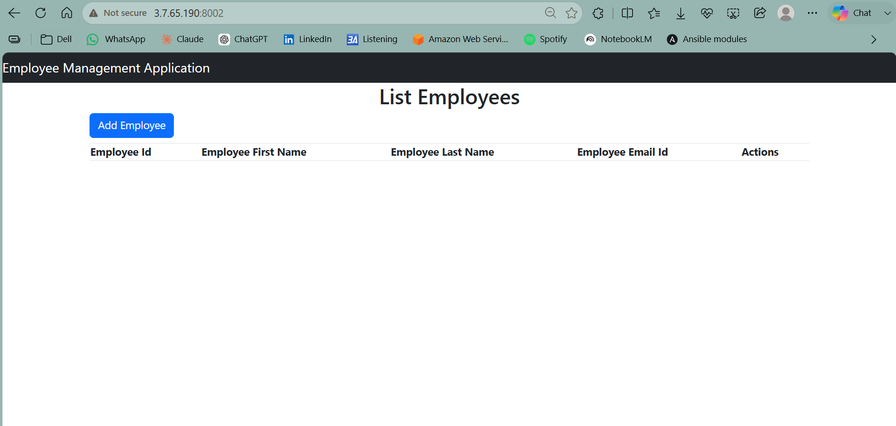
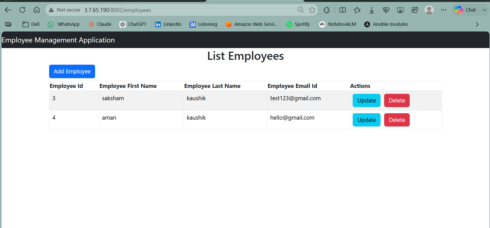
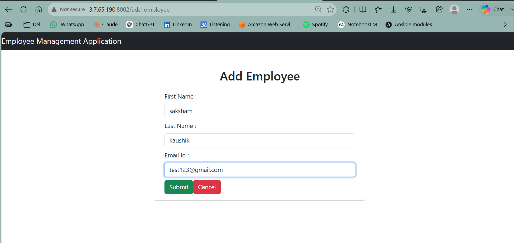
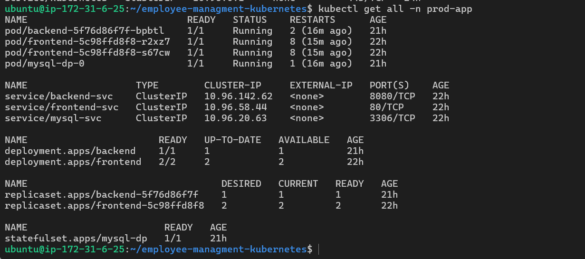
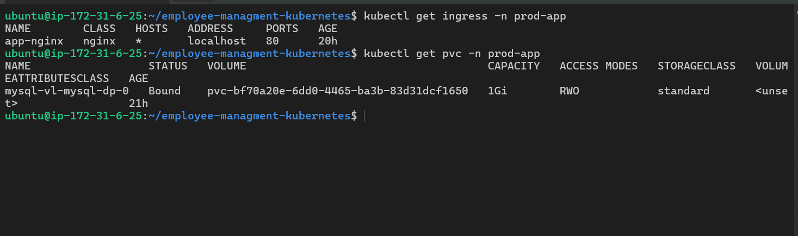

# Employee Management System - DevOps Deployment

A full-stack Employee Management System deployed using Docker, Kubernetes, Nginx, and AWS EC2.

This repository showcases my hands-on experience with containerization, orchestration, and cloud deployment. While the application is based on an open-source React + Spring Boot project, the complete deployment pipeline—including Docker, Docker Compose, Kubernetes, Nginx, and AWS EC2—was implemented by me as part of my DevOps learning journey.

---

## Project Preview

### Home Page



### Employee List



### Add Employee



---

## Tech Stack

- React
- Spring Boot
- MySQL
- Docker
- Docker Compose
- Kubernetes
- Nginx
- AWS EC2

---

## Features

- Employee CRUD Operations
- Multi-stage Docker builds
- Docker Compose deployment
- Nginx Reverse Proxy
- Kubernetes Deployments
- Kubernetes Services
- ConfigMaps & Secrets
- Persistent Volume Claim (PVC)
- Kubernetes Ingress
- AWS EC2 Deployment

---

## Kubernetes Deployment

### Cluster Resources



### Ingress & Persistent Volume Claim



---

## Architecture

### Docker Compose

```text
Browser
   │
Nginx
   │
React
   │
Spring Boot
   │
MySQL
```

### Kubernetes

```text
Browser
   │
Ingress
   │
Frontend Service
   │
Frontend Pod (React + Nginx)
   │
Backend Service
   │
Backend Pod (Spring Boot)
   │
MySQL Service
   │
MySQL Pod
```

---

## Repository Structure

```text
.
├── docker-compose.yml
├── react-hooks-frontend/
├── springboot-backend/
├── k8s/
├── images/
└── README.md
```

---

## Skills Demonstrated

- Docker
- Docker Compose
- Kubernetes
- Nginx
- AWS EC2
- Linux
- Container Networking
- ConfigMaps
- Secrets
- Persistent Volumes
- Ingress
- Reverse Proxy Configuration

---

## Future Improvements

- Helm Charts
- Jenkins CI/CD Pipeline
- Terraform Infrastructure as Code
- Prometheus & Grafana Monitoring

---

## Credits

The application source code is based on the open-source Employee Management System by Java Guides.

The Docker, Docker Compose, Kubernetes manifests, Nginx configuration, and AWS EC2 deployment were implemented by me as part of my DevOps learning journey.
